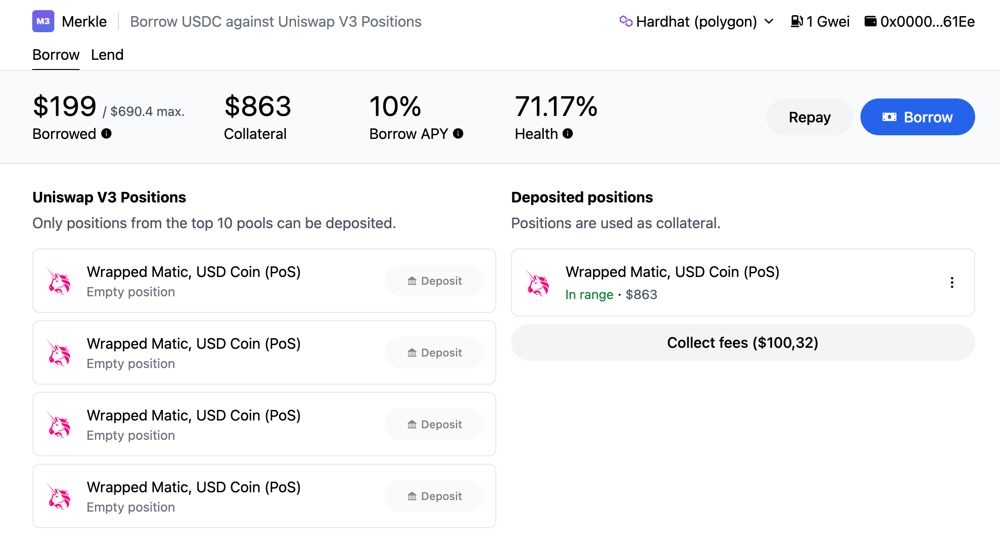

 

**Merkle is live on mainnet**. [Open app](https://lending.usemerkle.com) - [Join us on discord](https://discord.gg/Q9Dc7jVX6c).

# Merkle lending

Merkle is a new kind of lending platform that can accomodate much more complicated assets than Aave or Compound.

On Aave (or Compound), only tokens can be used as collateral. On Merkle, anything can be used as a collateral.

Collateral classes are created and approved by the community. To start, Merkle has one kind of collateral possible: Uniswap V3 positions. [Learn more](https://docs.usemerkle.com/)

**Calling for liquidity**: In order to incentivize [liquidity](https://docs.usemerkle.com/liquidity-providers) and utilization of rate, Merkle has an attractive [rewards system](https://docs.usemerkle.com/tokenomics/issuance) issuing Merkle (MKL) tokens.

### Getting started 

Go to [lending.usemerkle.com](https://lending.usemerkle.com) and start borrowing and lending. The Merkle frontend is [opensource](https://github.com/merkle3/lending-ui).

### Audit

The Merkle contracts are not audited, use at your own risk.